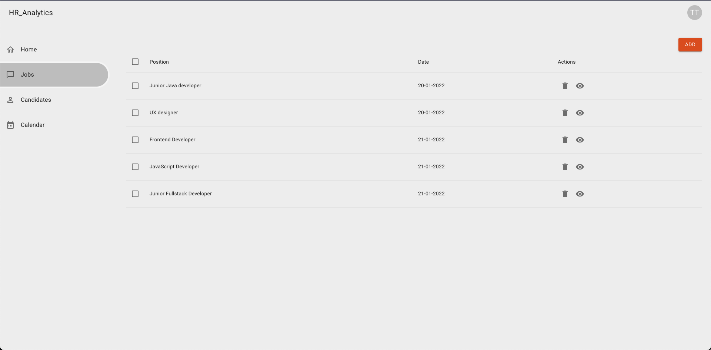

## Delete job 
Stwórz branch na bazie gałęzi main:
`git checkout -b feature/delete-job main`

## Subtaski
- Do kolumny actions w tabelce z ofertami pracy dodaj ikonkę śmietnika, która będzie przyciskiem wywołującym request do api
- Request: `DELETE jobs/:id`
- Po usunięciu oferty pracy, rząd z tabelki z daną ofertą powinien się od razu usunąć (optimistic update)

## Nice to have
- Obsłuż błąd z api

## Szacunkowa estymacja: 2h

## Pre code review checklist

W folderze `/tasks/pre-code-review` znajdziesz listę z punktami, które należy sprawdzić przed stworzeniem każdego merge requestu. To pozwoli Ci wychwycić błędy lub dodatkowe miejsca do usprawnienia przed procesem code review.

## Przykłady:

